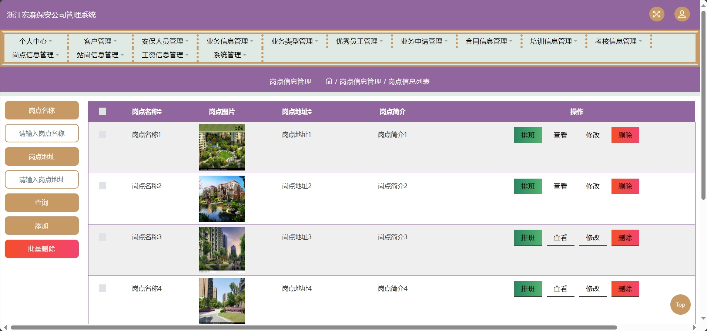
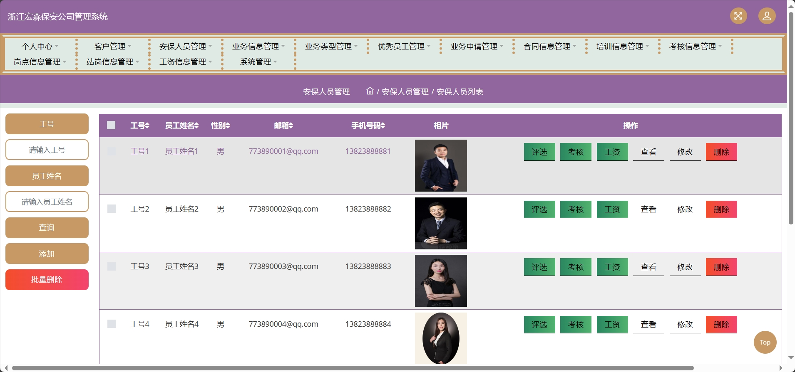
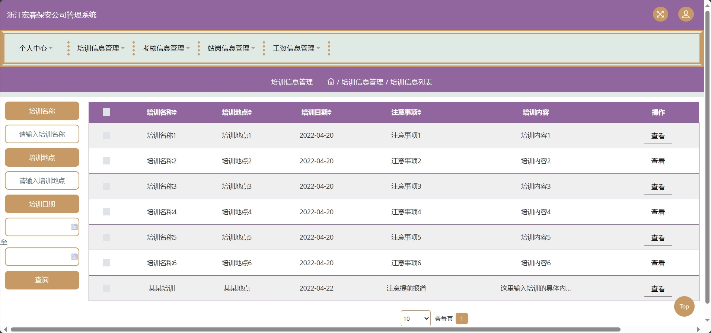
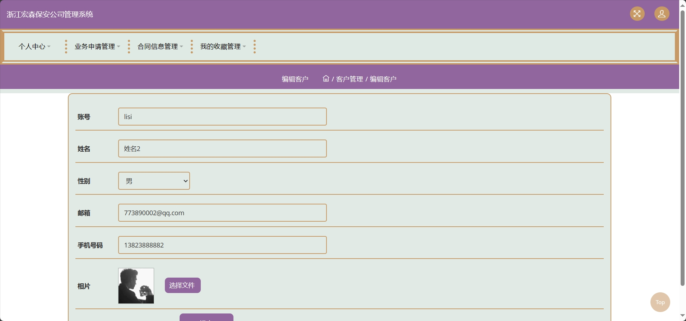
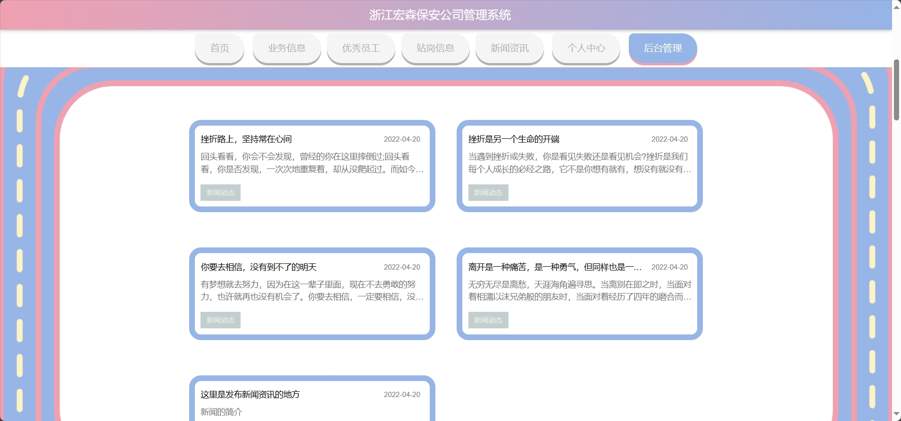
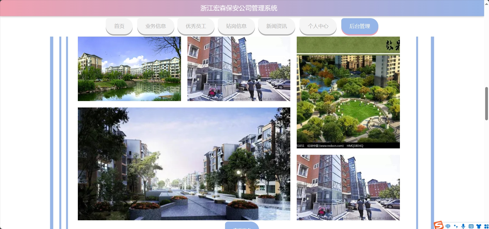

<h1 align="center">基于SSM框架的安保公司管理系统</h1>

 获取sql文件 QQ: 605739993 QQ群: 377586148 

 [个人站点: 从戎源码网](https://armycodes.com/)

## 简介

> 本代码来源于网络,仅供学习参考使用!
>
> 提供1.远程部署/2.修改代码/3.设计文档指导/4.框架代码讲解等服务
>
> 后台地址：http://localhost:8080/jspm77715/jsp/login.jsp
>
> 管理员: admin 密码: 123456
> 
> 安保人员：工号1 密码: 123456
>
> 用户端地址：http://localhost:8080/jspm77715/front/index.jsp
>
> 用户：账号1 密码: 123456
>

## 项目介绍

基于SSM框架的安保公司管理系统：前端 JSP、LayUI、JQuery、Ajax，后端 maven、springmvc、mybatis；角色分为管理员、安保人员和用户。管理员在后台管理岗位信息和安保人员工资、发布新业务、对合同进行管理、制定培训计划等；安保人员按分配的业务进行安保服务、查看自己的工资情况等；用户对安保公司的咨询进行查看、对业务进行查看、收藏安保人员。主要功能如下：

### 启动方式

- 前端：
> 按钮启动 | 启动Tomcat

- 后端：
> 按钮启动 | 启动Tomcat

### 管理员：

- 基本操作：登录、修改密码、获取个人信息、修改个人信息、上传图片
- 岗点信息管理：获取岗点信息列表、查看岗点信息详情、筛选岗点信息、排班、修改岗点信息、删除岗点信息、发布岗点信息
- 客户管理：获取客户信息列表、查看客户信息详情、筛选客户信息、修改客户信息、删除客户信息、新增客户信息
- 站岗信息管理：获取站岗信息列表、查看站岗信息详情、筛选站岗信息、修改站岗信息、删除站岗信息
- 安保人员管理：获取安保人员信息列表、查看安保人员信息详情、筛选安保人员信息、修改安保人员信息、删除安保人员信息、新增安保人员信息、评选优秀安保人员、考核、工资发放
- 业务信息管理：获取业务信息列表、查看业务信息详情、筛选业务信息、修改业务信息、删除业务信息、发布业务信息
- 轮播图管理：获取轮播图列表、查看轮播图详情、修改轮播图
- 新闻咨询管理：获取新闻咨询列表、查看新闻咨询详情、修改新闻咨询、发布新闻咨询、修改新闻咨询、删除新闻咨询
- 业务类型管理：获取业务类型信息列表、查看业务类型信息详情、筛选业务类型信息、修改业务类型信息、删除业务类型信息、新增业务类型信息
- 优秀员工管理：获取优秀员工信息列表、查看优秀员工信息详情、筛选优秀员工信息、修改优秀员工信息、删除优秀员工信息
- 业务申请管理：获取业务申请信息列表、查看业务申请信息详情、筛选业务申请信息、修改业务申请信息、删除业务申请信息、审核、合同
- 合同信息管理：获取合同信息列表、查看合同信息详情、筛选合同信息、修改合同信息、删除合同信息
- 培训信息管理：获取培训信息列表、查看培训信息详情、筛选培训信息、修改培训信息、删除培训信息、新增培训
- 考核信息管理：获取考核信息列表、查看考核信息详情、筛选考核信息、修改考核信息、删除考核信息

### 安保人员：

- 基本操作：登录、修改密码、获取个人信息、修改个人信息、上传图片
- 培训信息管理：获取培训信息列表、查看培训信息详情、筛选培训信息
- 考核信息管理：获取考核信息列表、查看考核信息详情、筛选考核信息
- 工资信息管理：获取工资信息列表、查看工资信息详情、筛选工资信息

### 用户：

- 基本操作：登录、注册、修改密码、获取个人信息、修改个人信息
- 业务申请管理：获取业务申请信息列表、查看业务申请信息详情、筛选业务申请信息、修改业务申请信息、删除业务申请信息
- 合同信息管理：获取合同信息列表、查看合同信息详情、筛选合同信息、下载合同
- 收藏管理：获取收藏列表、查看收藏详情、筛选收藏、取消收藏
- 新闻咨询模块：获取新闻咨询列表、查看新闻咨询详情、筛选新闻咨询
- 业务信息模块：获取业务信息列表、查看业务信息详情、筛选业务信息、业务申请、获取业务类型列表
- 优秀员工模块：获取优秀员工列表、查看优秀员工详情、筛选优秀员工、收藏优秀员工
- 站岗信息模块：获取站岗信息列表、查看站岗信息详情、筛选站岗信息、收藏站岗信息

## 环境

- <b>IntelliJ IDEA 2020.3</b>

- <b>Mysql 5.7.26</b>
  
- <b>Maven 3.6.3</b>

- <b>Tomcat 9.0.60</b>

- <b>JDK 1.8</b>

## 运行截图

